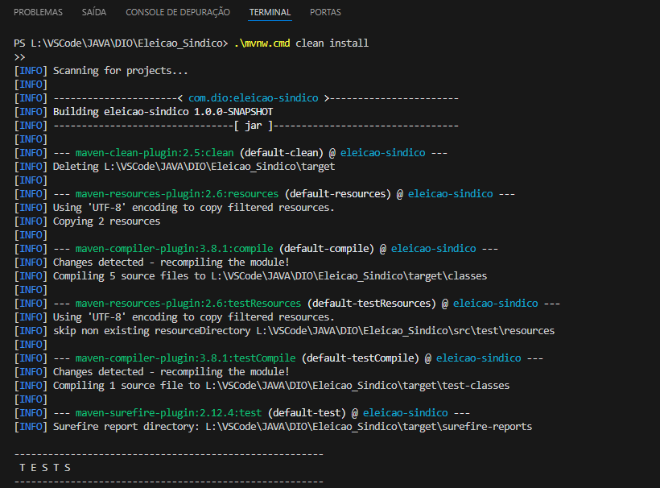
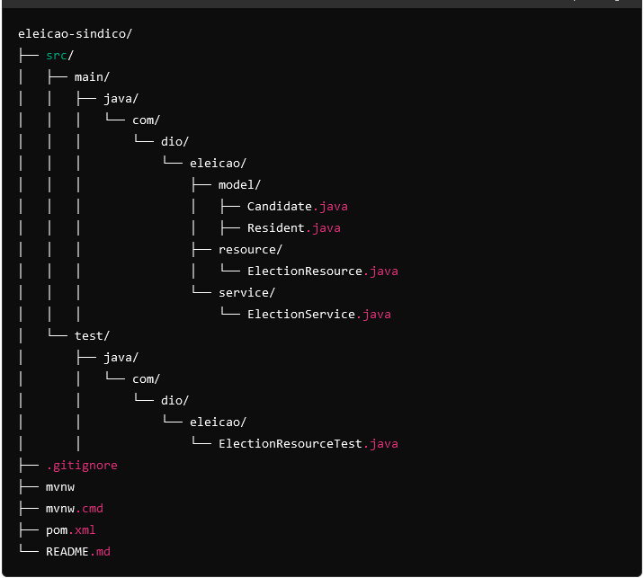
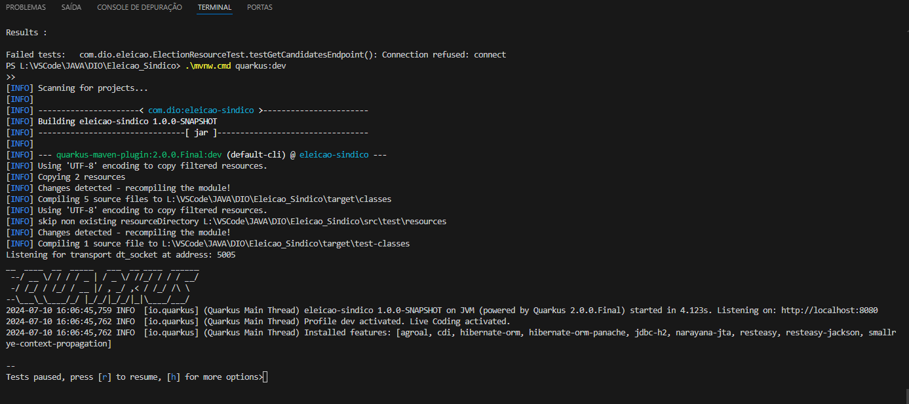
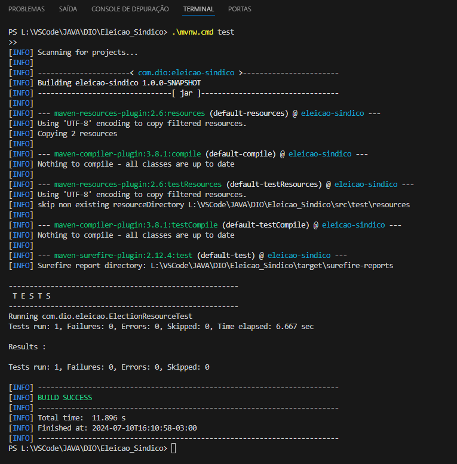

# Desenvolvendo um Sistema para Eleição Usando Quarkus Framework

Este projeto consiste no desenvolvimento de um sistema de eleição para síndico de apartamentos utilizando o Quarkus Framework. Dois candidatos estão inscritos para a eleição: João e Pedro. A aplicação permite listar os candidatos e registrar votos.

## Tecnologias Empregadas

    *Java 17:* Linguagem de programação principal utilizada para o desenvolvimento da aplicação.
    *Quarkus:* Framework Java supereficiente e otimizado para GraalVM e OpenJDK HotSpot.
    *Hibernate ORM com Panache:* Utilizado para simplificar o acesso ao banco de dados.
    *RESTEasy:* Para a criação de serviços RESTful.
    *H2 Database:* Banco de dados em memória utilizado para persistência de dados durante o desenvolvimento.
    *JUnit 5:* Framework de testes utilizado para a criação e execução de testes automatizados.
    *Maven:* Ferramenta de automação de compilação utilizada para gerenciamento de dependências e ciclo de vida do projeto.
    *Visual Studio Code:* IDE utilizada para o desenvolvimento do projeto.

## Estrutura do Projeto

A estrutura do projeto segue a convenção padrão do Maven:

    eleicao-sindico/
    ├── src/
    │   ├── main/
    │   │   ├── java/
    │   │   │   └── com/
    │   │   │       └── dio/
    │   │   │           └── eleicao/
    │   │   │               ├── model/
    │   │   │               │   ├── Candidate.java
    │   │   │               │   ├── Resident.java
    │   │   │               ├── resource/
    │   │   │               │   └── ElectionResource.java
    │   │   │               └── service/
    │   │   │                   └── ElectionService.java
    │   └── test/
    │       ├── java/
    │       │   └── com/
    │       │       └── dio/
    │       │           └── eleicao/
    │       │               └── ElectionResourceTest.java
    ├── .gitignore
    ├── mvnw
    ├── mvnw.cmd
    ├── pom.xml
    └── README.md

## Configuração do Ambiente

## Pré-requisitos*

    1. Java 17: Certifique-se de ter o JDK 17 instalado e configurado corretamente em seu PATH.
    2. Maven: Certifique-se de ter o Maven instalado e configurado corretamente em seu PATH.
    3. IDE: Recomenda-se utilizar o Visual Studio Code com as extensões adequadas para Java e Quarkus.

## Configuração do Projeto*

    1. Clone o repositório:

    git clone <URL-do-repositorio>
    cd eleicao-sindico

    2. Compile e instale as dependências do projeto:

    ./mvnw clean install

    3. Execute a aplicação em modo de desenvolvimento:

    ./mvnw quarkus:dev

## Considerações Importantes

    Configuração do Java Home: Assegure-se de que o JAVA_HOME esteja apontando para o JDK 17.
    Versão do Quarkus: Utilize a versão 2.0.0.Final do Quarkus para evitar problemas de compatibilidade.
    Banco de Dados H2: A aplicação está configurada para utilizar um banco de dados H2 em memória, ideal para desenvolvimento e testes.

## Endpoints da API

1. Listar Candidatos

    URL: /election/candidates
    Método HTTP: GET
    Resposta:

    [
    {
        "id": 1,
        "name": "João"
    },
    {
        "id": 2,
        "name": "Pedro"
    }
    ]

2. Registrar Voto

    URL: /election/vote

    Método HTTP: POST

    Requisição:
    {
    "residentId": 1,
    "candidateId": 2
    }
    Resposta: HTTP Status 200 (OK) se o voto for registrado com sucesso.

## Testes Automatizados

Os testes são realizados utilizando JUnit 5 e RestAssured para garantir que os endpoints da API estão funcionando corretamente. Para executar os testes, utilize o comando:

    ./mvnw test

## Conclusão

Este projeto demonstra como desenvolver uma aplicação simples de eleição utilizando o Quarkus Framework, integrando diversas tecnologias e boas práticas de desenvolvimento de software. O uso de Quarkus proporciona uma aplicação rápida e eficiente, adequada para ambientes de desenvolvimento modernos.

Para mais informações sobre Quarkus, visite a documentação oficial.

## Imagens

